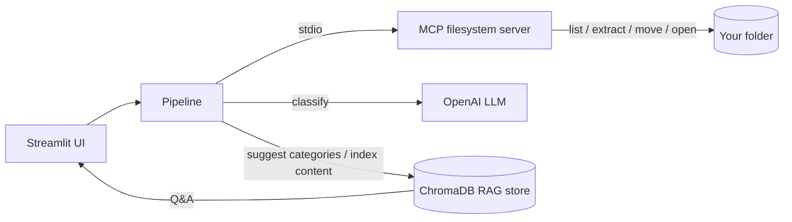

# 🗂️ AI File Organizer

An AI-powered desktop file organizer built with **Streamlit**, a local **MCP**
(Model Context Protocol) server, **RAG** (ChromaDB), and an **OpenAI** vision LLM.
Point it at a messy folder and it reads every file — text, documents, and images —
classifies each into a clean two-level category hierarchy (e.g. `Images/Memes`,
`Documents/Invoices`, `Videos/TV Shows`), and **copies or moves** it into an
`Organized/` folder. You can then ask natural-language questions about your files
and open them straight from the results.

## What's inside

| Piece | Role |
| --- | --- |
| **Streamlit** | UI: pick a folder, choose options, watch progress, ask questions, open files |
| **MCP server** | A local [Model Context Protocol](https://modelcontextprotocol.io) server that owns all filesystem access — recursive listing, content extraction (PDF/DOCX/text/images), moving/copying, and opening files |
| **OpenAI LLM** | Classifies each file into `Top/Sub` categories; images are read visually. Default model `gpt-5` (any vision-capable model works) |
| **RAG (ChromaDB)** | Keeps categories consistent across runs **and** indexes file contents so you can ask questions and locate files |

## Features

- 🧠 **AI classification** into a max two-level folder hierarchy; images read with vision.
- 📂 **Copy, Move, or Preview** — keep originals, relocate them, or just see the plan.
- 🔁 **Recursive deep scan** — finds files nested at any depth.
- 🧺 **Flatten** — gather files scattered across sub-folders into one flat folder first.
- ↕️ **Sort control** — process newest / oldest / largest / smallest / by name first.
- ⚡ **Concurrent processing** — classify several files in parallel (tunable).
- 🛡️ **Code-safe** — source-code files are skipped so projects aren't disturbed.
- 🎬 **Binary aware** — videos / audio / archives are classified by filename, not read.
- 🔎 **RAG Q&A** — ask about your files; open a result's file or folder in one click.
- ♻️ **Rate-limit handling** — automatic retry / backoff on OpenAI 429s.
- 🪟 **Windows long-path support** so long filenames don't fail to move.

## How it works



For each file the pipeline (running several files in parallel):
1. asks the **MCP server** to extract its content (text, or a resized image),
2. pulls similar existing categories from the **RAG** store to stay consistent,
3. asks the **LLM** for a `top_category`, optional `sub_category`, and a summary,
4. asks the **MCP server** to copy/move the file into `Organized/Top/Sub/`,
5. indexes the content in **RAG** so it becomes searchable.

## Setup

Requires Python 3.10+.

```powershell
# from the project folder
python -m venv .venv
.\.venv\Scripts\Activate.ps1
pip install -r requirements.txt

# configure your key
Copy-Item .env.example .env
# then edit .env and set OPENAI_API_KEY=sk-...
```

## Run

```powershell
streamlit run app.py
```

Then open http://localhost:8501 and:

1. *(Optional)* Expand **Flatten nested folders** to pull files out of sub-folders
   into one flat folder first.
2. Enter the **folder to organize**.
3. Pick an **action**: Copy (keep originals), Move, or Preview (no changes).
4. Set **how many files** (or tick **Classify ALL files**), the **sort order**,
   the **output subfolder name**, **recursive** sub-folder scanning, and the
   number of **parallel workers**.
5. Click **🚀 Organize**. Results show each file's category, summary, and
   destination, plus any failures with the real error.
6. Use **🔎 Ask about your organized files** to query them, and **📂 Open file** /
   **📁 Open folder** on any source. **🗑️ Clear index** wipes the RAG store.

## Configuration (`.env`)

| Variable | Default | Meaning |
| --- | --- | --- |
| `OPENAI_API_KEY` | — | Your OpenAI key (required) |
| `OPENAI_CHAT_MODEL` | `gpt-5` | Classification model (use a vision model for images; `gpt-4o-mini` / `gpt-5-mini` are faster & cheaper) |
| `OPENAI_EMBED_MODEL` | `text-embedding-3-small` | Embeddings for the RAG store |
| `MAX_TEXT_CHARS` | `8000` | Max characters read per text file |
| `MAX_IMAGE_DIM` | `1024` | Images are resized to this max dimension before upload |
| `RAG_DIR` | `.rag_store` | Where the ChromaDB vector store is persisted |

## Project layout

```
app.py              # Streamlit UI
mcp_server.py       # Local MCP server: list, extract, move/copy, open (stdio)
core/
  config.py         # Settings from .env
  mcp_client.py     # Async MCP stdio client + open_path helper
  classifier.py     # OpenAI classification (text + vision)
  rag.py            # ChromaDB categories + file index, Q&A
  oai_retry.py      # Retry / backoff for OpenAI rate limits & timeouts
  pipeline.py       # Concurrent orchestration: list -> extract -> classify -> place -> index
requirements.txt
.env.example
```

## Notes & safety

- **Copy vs Move** — Copy (default) keeps your originals; Move relocates them.
  The MCP server never overwrites — a numeric suffix is added on name clashes.
- **Point at the source, not the output.** Organizing an already-`Organized`
  folder re-nests files — use the original messy folder.
- **Source-code files are skipped** so an existing project is never broken.
- **Your API key** lives in `.env`, which is git-ignored. Never commit it; rotate
  it if it is ever exposed.
- **Data leaves your machine** — file contents / images are sent to OpenAI. Don't
  run it on files you can't share.
- **Opening files** uses the OS default handler and runs on the machine hosting
  the app; opening an `.exe` would launch it.

## Troubleshooting

- **429 / rate limit** — you exceeded the model's tokens-per-minute. The app
  retries automatically; lower **Parallel workers** or switch to
  `gpt-4o-mini` / `gpt-5-mini` for higher limits.
- **`temperature does not support 0`** — reasoning models (gpt-5, o-series) only
  allow the default; the app already handles this automatically.
- **Edits not taking effect** — Streamlit caches imported modules; fully restart
  (`Ctrl+C`, then `streamlit run app.py`) after code changes.
